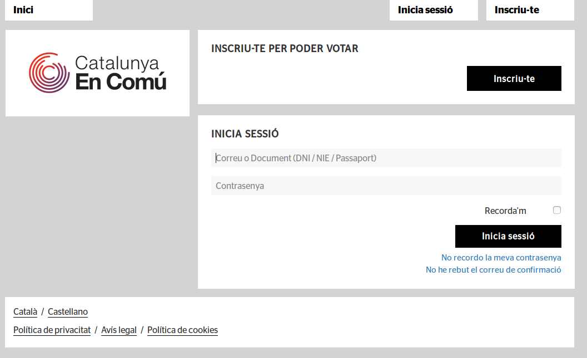
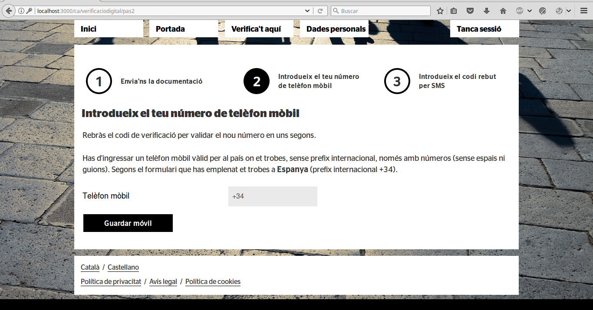
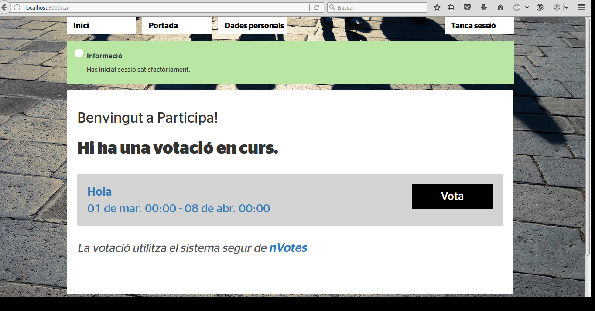

# Participa

El objetivo de esta aplicación es ofrecer una interfaz única a los usuarios
interesados donde inscribirse a una organización.

Entre las funcionalidades en las que consiste ahora mismo es con elecciones
(integración con nVotes), Colaboraciones económicas (donaciones
periódicas), Microcréditos (sistema de prestamos distribuidos), Notificaciones
móviles (para dispositivos Android),







## Funcionalidades

### Elecciones

Permite servir de censo integrado con nVotes: *nVotes es un
software libre de votaciones que permite a cualquier organización realizar
procesos electorales de forma segura, flexible, transparente y a un precio
competitivo*. Permite que las elecciones se realicen en función a la
localización del inscrito. En el caso de Podemos, se hace para diferenciar las
elecciones de los ámbitos Municipales, Provinciales, Autonómicas y Estatales. A
través de esta herramienta se han realizado todas las votaciones vinculantes de
Podemos desde hace más de medio año, más de 30 votaciones: documentos
organizativos, eticos y políticos, elecciones de cargos internos (secretario
general, consejos ciudadanos estatales, autonómicos y minicipales), las
distintas fases e iniciativas del proyecto Impulsa, etc. También lo ha
utilizado Barcelona En Comú para sus Primarias (candidatos para las elecciones
municipales, consejeros y consejeras de distrito y priorización de las 40
medidas iniciales del gobierno).

* https://agoravoting.com/
* http://www.eldiario.es/hojaderouter/internet/Podemos-votacion-seguridad-Pablo-Iglesias_0_318118945.html
* http://www.europapress.es/catalunya/noticia-3000-personas-respaldan-primarias-barcelona-comu-20150311120628.html

### Colaboraciones económicas

Permite que los usuarios inscritos puedan configurar donaciones de forma
periódica (mensual, trimestral o anual) por el importe que quieran (desde 5 a
50€). Permite que esta colaboración se produzca a través de transferencia
bancaria o con tarjeta de crédito (conexión con Redsys). Es una de las
principales formas de ingresos de Podemos (más de 300.000€).

* http://transparencia.podemos.info/cuentas-claras/partido/ingresos
* http://transparencia.podemos.info/preguntas-frecuentes

### Microcréditos

Permite que usuarios (inscritos o no) den de alta préstamos a la organización
de forma puntual. Ha servido para financiar la campaña electoral del año 2015
de Podemos en todas las Comunidades Autonómicas (más de 1.500.000€).

* http://transparencia.podemos.info/preguntas-frecuentes
* http://www.bolsamania.com/noticias/politica/como-funcionan-los-microcreditos-con-los-que-podemos-ha-financiado-la-campana-electoral--743443.html

### Iniciativas Ciudadanas

Sistema de llegada de propuestas filtradas por votaciones con +1 bottom-up
tomando como modelo el sistema planteado en el documento Organizativo de
Podemos. Sobre esto mismo se realizará el sistema de Recovatorios de Cargos.
Toma iniciativas de una categoría ("Propuestas") en la Plaza Podemos (subreddit
de Podemos). Todavía ninguna iniciativa a cumplido los requisitos mínimos de
participación impuestos por Podemos.

* http://www.eldiario.es/politica/Podemos-sistema-iniciativas-ciudadanas-revocatorios_0_369914239.html
* http://labodemo.net/es/2015/03/28/labodemo-ayuda-a-lanzar-las-iniciativas-ciudadanas-en-podemos/

### Equipos de Participación

Permite a los inscritos darse de alta como interesado en formar parte de
equipos localizados geográficamente para fomentar la participación presencial y
la formación sobre la participación digital.

* http://www.europapress.es/nacional/noticia-podemos-crea-estructura-participacion-paralela-circulos-articulara-equipos-accion-20141217145841.html

### Verificación presencial

Método de verificación utilizado por Barcelona En Comú. Una vez el usuario se
inscribe digitalmente debe ir a verificarse presencialmente. Por otro lado un
grupo de usuarios de confianza para la organización se encarga de verificar
presencialmente los documentos con los requisitos mínimos que debe cumplir (ser
mayor de 16 años y con domicilio en Barcelona).

* https://barcelonaencomu.cat/es/post/inscribete-bcomu-hagamos-juntos-otra-barcelona

### Verificación digital

Método de verificación utilizado por Podemos (en su versión simplificada que
sólo require confirmar el teléfono) y por CatComu. Cuando un usuario se inscribe
debe confirmar su correo electrónico y su teléfono móvil con un código que se
le envía. Así mismo, debe subir a la aplicación para probar su identidad, y que
luego serán verificados para poder confirmar el voto. Esto supone un compromiso
un sistema más inseguro pero que fomenta más la participación (como el de
Podemos), o un sistema de verificación puramente presencial, más seguro pero
menos accesible (como el de Barcelona En Comú).

En general, cualquier sistema de verificación se complementa herramientas de
Reportes de grupos de usuarios y de Anti Spam con blacklists.

* http://www.eldiario.es/turing/tecnologia-detras-voto-online-primarias_0_238326398.html

### Blog (Brújula)

Sistema de publicación de noticias que sirve de forma de argumentario y
comunicación interna con sus inscritos.

### Newsletter

Sincronización de usuarios entre sistemas (Participa y Sendy) para los
distintos casos que puede haber de falta de sincronía entre las bases de datos,
es decir, si un usuario se quiere dar de baja sólo de la newsletter o si quiere
darse de baja completamente como usuario.

* https://sendy.co/

### Formularios y páginas estáticas

Sistema de integración con formularios basados en Wordpress (con el plugin
privativo Gravity Forms).

* http://www.gravityforms.com/

### Notificaciones móviles

Se ha hecho una aplicación en Android que sirve para que se pueda enviar
notificaciones a los dispositivos móviles. Se utiliza para avisar cuando hay
una nueva votación en curso (módulo de Eleciones) así como para hacer avisos
durante la campaña electoral. Se trata de una aplicación realizada con
Phonegap, por lo que está planificado su desarrollo para IOS (iPhone e iPad).

* https://play.google.com/store/apps/details?id=info.podemos.participa&hl=en

### OpenID

Se ha configurado para que la aplicación sea un proveedor de OpenID, por lo que
permite que otras aplicaciones autentifiquen contra los usuarios del censo. Se
ha utilizado para la aplicación de "La Expresión del Cambio" (concurso de
carteles y canciones).

* https://laexpresiondelcambio.info/board/550096f30ee95e0000000007

## Dependencias

Para ejecutar la aplicación en su totalidad hay que tener los siguientes
paquetes instalados:

```
sudo apt-get install postgresql                     # para la base de datos
sudo apt-get install imagemagick                    # para la generación del captcha
sudo apt-get install redis-server                   # para la gestión de las colas de trabajo (resque)
sudo apt-get install libpq-dev                      # para la gema pg
sudo apt-get install qt5-default libqt5webkit5-dev  # para capybara (tests)
sudo apt-get install wkhtmltopdf                    # para generación de PDFs (microcreditos)
sudo apt-get install nodejs                         # para la compilación de assets
```

## Instalación

Es una aplicación Ruby On Rails hecha con Rails 4.2 / Ruby 2.3. Se recomienda
hacerla en sistemas operativos GNU/Linux (nosotros usamos Ubuntu). Para manejar
las gemas usamos `bundler`. Para la BBDD recomendamos postgres, pero se puede
usar también mysql/sqlite3.

Una vez se tengan instaladas las dependencias y configurado ruby, los pasos a
seguir serían los siguientes:

```
bundle install
cp config/database.yml.example config/database.yml
cp config/secrets.yml.example config/secrets.yml
sudo -u postgres psql -c "CREATE USER participa WITH NOSUPERUSER CREATEDB NOCREATEROLE PASSWORD 'participa'"
bundle exec rake db:create
bin/rake db:migrate
bin/rails server
```

Aparte de esto para algunas acciones utilizamos [resque](), una cola para
trabajos asincronos.

## Tests

Para correr los tests hay que preparar primero la base de datos de test

```
RAILS_ENV=test bin/rake db:migrate
```

Después se pueden comprobar con

```
bin/rake test
```

Todos deberían dar OK o SKIP (significa que se pasa por alto, y que hay que
programarlo). CI is also implemented using [travis-ci](http://travis-ci.org/).

## APIs externas

* Para las votaciones de los usuarios usamos
  [nVotes](https://nvotes.com/), que han realizado una integración
  con la plataforma de Podemos. La configuración del secreto compartido se
  encuentra en una clave de `secrets.yml`.

  Documentación:
    * [Sobre la integración, al momento de escribir esto](https://github.com/agoravoting/agora-core-view/blob/9dfbbf5252b2eb119463d2dcaa2c01391b232653/INTEGRATION.md),
    * [Sobre la integración, versión más actualizada](https://github.com/agoravoting/agora-core-view/blob/master/INTEGRATION.md),
    * [Sobre la API REST general de AgoraVoting](https://agora-ciudadana.readthedocs.org/).

* Para el envío de SMS usamos una API WSDL. La configuración de la autenticación se encuentra en unas claves de `secrets.yml` y el código para el envio en `lib/sms.rb`

* Para el control de excepciones en staging y production usamos una instancia
  privada de la Asociación aLabs de [errbit](https://github.com/errbit/errbit),
  una aplicación libre basada en la API de [airbrake](https://airbrake.io/).
  Puede comprobarse la conexión con el servidor con el comando `bin/rake
  airbrake:test`. La configuración de la autenticación se encuentra en unas
  claves de `secrets.yml`.

* Para la gestión de las colas de trabajo utilizamos
  [resque](https://github.com/resque/resque/), que usa como DDBB redis. Un
  comando útil para desarrollo es el de iniciar un worker: `bin/rake
  resque:work`

* En desarrollo, para comprobar el envio de correos, utilizamos
  [mailcatcher](http://mailcatcher.me/), una gema que levanta un servidor SMTP
  en el puerto 1025 y una interfaz web para ver los correos que se envían en el
  puerto 1080. Para levantarlo instalar la gema (`gem install mailcatcher`) y
  ejecutar el comando `mailcatcher`.

* Para el envío de correo en producción usamos
  [Amazon SES](http://aws.amazon.com/es/ses/). La configuración va en
  `config/secrets.yml`.

* Para descargar las últimas iniciativas ciudadanas en Plaza Podemos ejecutamos
  el comando: `bin/rake podemos:reddit`

## Configuraciones

Se ha intentado que todas las configuraciones esten accessibles con los
ficheros de configuración

```
config/databases.yml
config/secrets.yml
```

Ver ejemplos en `config/databases.yml.example` y `config/secrets.yml.example`.

## i18n

Para modificar los distintos idiomas, revisar los ficheros de `config/locales/`.
Para agregar uno nuevo se deben seguir los siguientes pasos:
* Agregarlo en la línea de 'scope locale' en `config/routes`
* Agregarlo en la UI de cambio de idiomas del footer en `app/views/layouts/application.html.erb`
* Agregarlo en la configuración para idiomas válidos en `config/application.rb`

## Newsletter

TODO: documentar integración con Sendy

## Colaboraciones

Para la forma de pago "Suscripción con Tarjeta de Crédito/Débito" hemos hecho
una integración con Redsys.

Para esto hace falta tener una cuenta bancaria dada de alta en Redsys, tener
acceso a su (entorno de pruebas)[https://sis-t.redsys.es:25443/canales/] y
configurar los parámetros necesarios en config/secrets.yml

Para realizar las pruebas en su entorno y que finalice correctamente es
necesario poner la siguiente información de tarjeta:

```
  Tarjeta: 4548812049400004
  Fecha de caducidad: 12/20
  Código de Seguridad: 123
  CIP: 123456
```

Se pueden ver los documentos desde los que se han partido para su
implementación en `doc/redsys`.

## Configuración inicial

Aparte de instalar y configurar la aplicación, inicialmente hay que
configurarla siguiendo los siguientes pasos:

1. Comprobar que se hayan instalado todas las gemas y librerias del sistema,
   que se haya realizado la creación y migración de la base de datos,
   configuración de servicios externos y claves privadas en secrets.yml, etc.
   Todo lo que pone en README.md y en bin/bootstrap.sh

2. La aplicación base consta de un censo de usuarios cuyo registro debe hacerse
   confirmando con envíos de correo y SMS. Si se quieren utilizar los otros
   módulos hay que poner habilitarlo en la sección de secrets.yml:

```
  features:
    collaborations: true
    microcredits: true
    elections: true
    proposals: true
    notifications: true
    participation_teams: true
```
